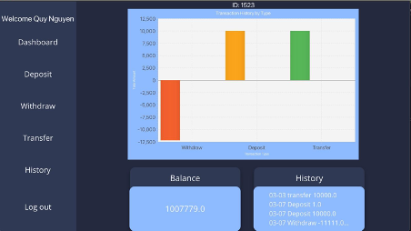
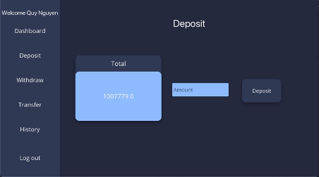
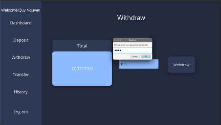
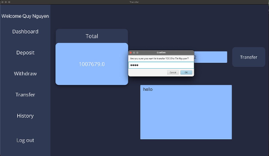
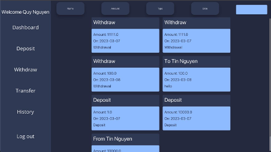

# BankManagement
## 1. Dashboard
The dashboard is the main screen of the application, which provides users with an overview of their finances. It displays a bar chart that shows the amount of money transferred by transfer type. Users can view their account balance, recent transactions, and the status of their pending transactions. The dashboard also provides quick access to the deposit, withdraw, and transfer features.

## 2. Deposit
The deposit feature allows users to add funds to their account. Users can enter the amount they want to deposit and select the account they want to deposit the funds into. Once the deposit is confirmed, the funds are added to the user's account balance.

## 3. Withdraw
The withdraw feature allows users to withdraw funds from their account. Users can enter the amount they want to withdraw and select the account they want to withdraw the funds from. The user must provide their password to confirm the transaction. Once the transaction is confirmed, the funds are deducted from the user's account balance.

## 4. Transfer
The transfer feature allows users to transfer funds from their account to another. Users can select the account they want to transfer funds from and the account they want to transfer funds to by account id. They must enter the amount they want to transfer and provide their password to confirm the transaction. Once the transaction is confirmed, the funds are deducted from the user's account balance and added to the recipient's account balance.

## 5. Transaction History
The transaction history feature allows users to view their transaction history. Users can sort their transactions by name, date, or amount. They can also search for specific transactions by name. The transaction history shows the account the transaction was made from, the account it was made to, the amount, and the date of the transaction.

